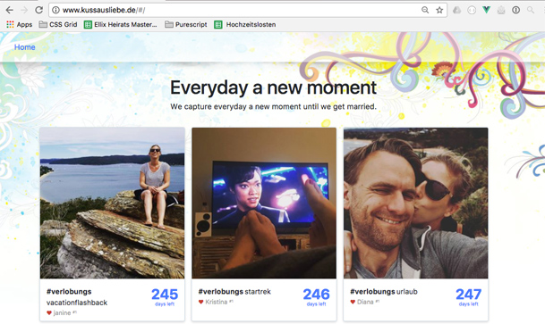

# The wall of memories

Goal of the project is to display instagram pictures on your own website and make it possible to do more advanced API aggregation, e.g. show the first liker of a media.

<p align="center">

</p>

[Demo](www.kussausliebe.de)
## Prologue

So, friends of mine were starting taking pictures until they get married. I guess for memory or something. And I thought, wow that's stressful and actually a cool idea.

A few days later, I somehow got engaged too and wanted to take there idea one step further. Creating a picture everyday and make it available to my friends and family. But wait: This platform already exists. It's called instagram. :)

True, but Instagram does not support to embed your pictures on your on own website. That's how I came up with that project.

## What was used?

Full stack of the application:

- [VueJS](vuejs.org) as a UI framework
- [Element UI](https://github.com/ElemeFE/element) as a UI library
- [Play-vue-webpack](https://github.com/gbogard/play-vue-webpack) webpack and play in one place
- [Scala Play](https://www.playframework.com/) as the backend
- [Scalaz](https://github.com/scalaz/scalaz) for EitherT

## Setup

1. Get an instagram access token

In order to access the instagramm API, you'll need a access token. The easiest way of creating one, is following the instructions on [Pixel Union](http://instagram.pixelunion.net/)

2. Clone this repository

```git clone git@github.com:don41382/kussausliebe.git ```

3. Create your own configuration

Edit a new file `conf/application-dev.conf` and add your instagram access token

```scala
include "application.conf"

instagram.token="--YOUR-KEY--"
```

4. Run sbt with the configuration

```sbt -Dconfig.file=config/application-dev.conf```

That's it!
